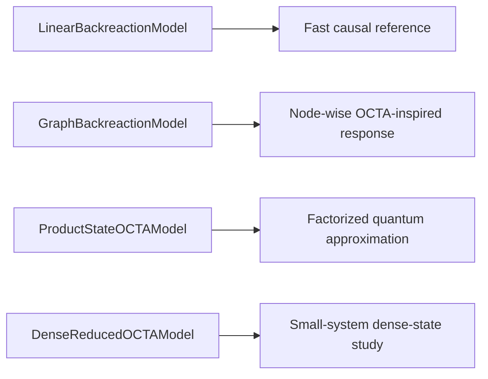
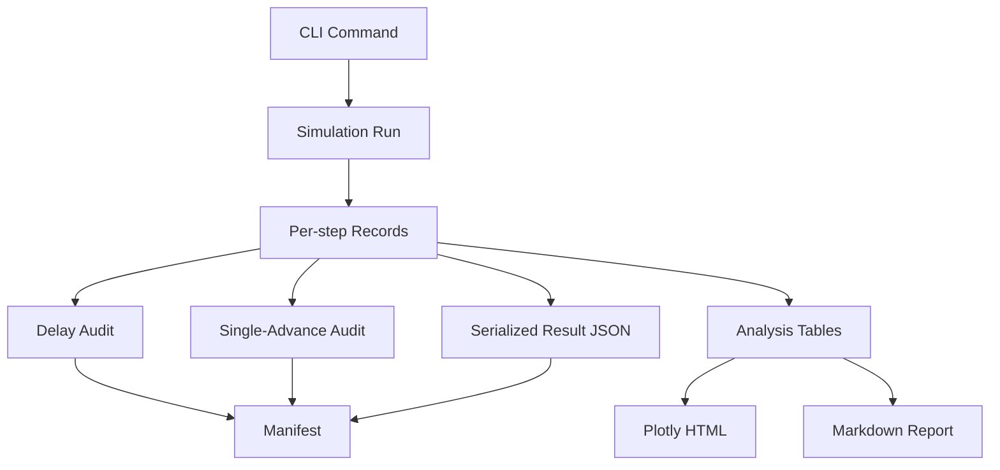

# EgTRQC

EgTRQC is a clean, reproducible PoC for delay-aware semiclassical backreaction experiments with OCTA-inspired reduced models.

The project is designed around three non-negotiable goals:

- mathematically exact delay semantics,
- reproducible and inspectable simulation artifacts,
- modular model families that can grow in physical fidelity without changing the causal contract.

## Why This PoC Exists

The repository provides a compact but serious reference implementation for experiments where delayed feedback matters physically and numerically.
Instead of mixing model evolution, diagnostics, and figure generation in one opaque flow, EgTRQC separates:

- instantaneous source evaluation,
- delayed effective-source evaluation,
- physical state advancement,
- diagnostics and artifact generation.

That separation keeps `delay_steps` meaningful, makes the implementation auditable, and provides a clean base for future extensions.

## Core Capabilities

EgTRQC currently offers:

- strict typing with Google-style docstrings,
- a delay buffer with exact `J(t_0)` prehistory semantics,
- executable audits for the pure-delay rule and single-advance-per-step updates,
- deterministic sweep execution with JSON manifests,
- OCTA-inspired model families spanning linear, graph, product-state, and dense-state regimes,
- Plotly HTML artifacts, CSV tables, and Markdown reports for analysis runs,
- automated tests and Sphinx-generated documentation.

## PoC Map

```mermaid
flowchart TD
    A[SimulationConfig] --> B[Model Family]
    A --> C[DelayBuffer]
    B --> D[Instantaneous Source J(t_n)]
    C --> E[Effective Source J_eff(t_n)]
    D --> C
    E --> F[Curvature Proxy / Response]
    F --> G[Physical State Advance]
    G --> H[Step Records]
    H --> I[Audits]
    H --> J[JSON / CSV / Plotly / Markdown Artifacts]
    G --> C
```

The key invariant is that the physical history is observed many times but advanced only once per physical time step.

## Model Families

The PoC exposes several levels of modeling detail:



These models share the same delay-aware simulator contract, so we can compare complexity levels without rewriting the causal machinery.

## Reproducibility Pipeline



## Quick Start

Run the core reproducibility sweep:

```bash
PYTHONPATH=src /home/jordieres/soft/vpy/bin/python -m egtrqc.cli run-sweep --output-dir artifacts/reference_sweep_vpy
```

Run the dense delay analysis:

```bash
PYTHONPATH=src /home/jordieres/soft/vpy/bin/python -m egtrqc.cli analyze-dense-delay --output-dir artifacts/dense_delay_analysis
```

Run the automated verification suite:

```bash
PYTHONPATH=src /home/jordieres/soft/vpy/bin/python -m pytest -q
```

Build the Sphinx documentation:

```bash
make -C docs html
```

Rebuild the full PoC in one command:

```bash
bash scripts/build_all.sh
```

## Command Surface

The current CLI is intentionally narrow:

- `run-sweep`: execute the deterministic delay sweep for the reference linear model.
- `analyze-dense-delay`: run the dense reduced OCTA-inspired sweep and generate tables, plots, and a report.

That narrow surface is deliberate. The PoC favors a small number of well-audited entry points over a large unstable script zoo.

## Repository Layout

- `src/egtrqc/`: typed package code.
- `tests/`: automated verification for delay semantics, simulator behavior, ensembles, and OCTA-inspired models.
- `artifacts/`: generated JSON, CSV, Plotly HTML, and Markdown analysis reports.
- `docs/`: Sphinx documentation sources and generated site output.

## Architectural Principles

EgTRQC follows a few simple rules:

1. The delay line is a first-class object, not hidden state.
2. Observation and mutation are separate operations.
3. Diagnostics consume records; they do not alter physics.
4. Models can vary, but the simulator contract should stay stable.
5. Every analysis should emit machine-readable artifacts and human-readable interpretation.

## Documentation

The full documentation lives in `docs/` and is generated with Sphinx.
It includes:

- conceptual overviews,
- architecture diagrams,
- theory and equations pages,
- workflow documentation,
- tutorial-style example paths,
- model-family descriptions,
- developer extension guidance,
- CLI guidance,
- API reference pages generated from the codebase.

## Scope

This PoC is a clean reproducible core.
It does not depend on notebook-era exploratory materials or legacy binary trace files.
Future extensions can add richer physics on top of the same delay-buffer and audit contracts without changing the causal semantics.

A zenodo entry has been created `https://zenodo.org/records/20933821`, which includes the DOI: `10.5281/zenodo.20933821`.